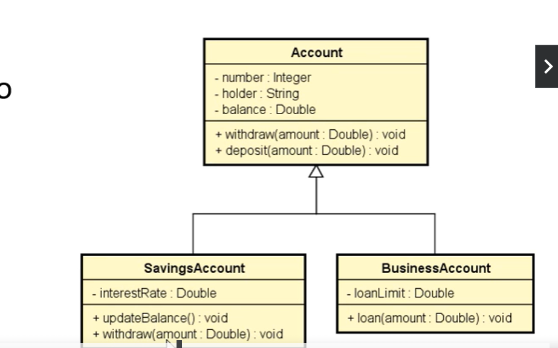
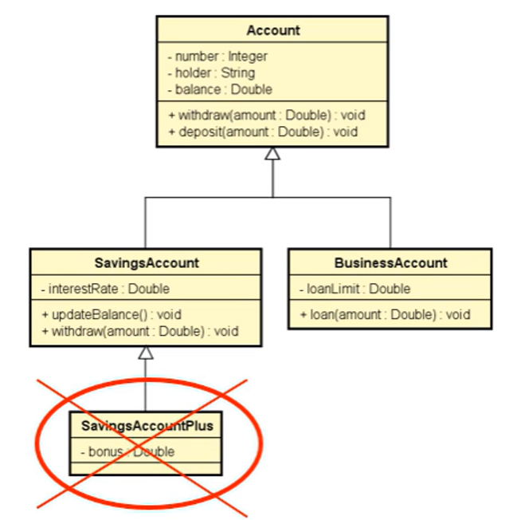
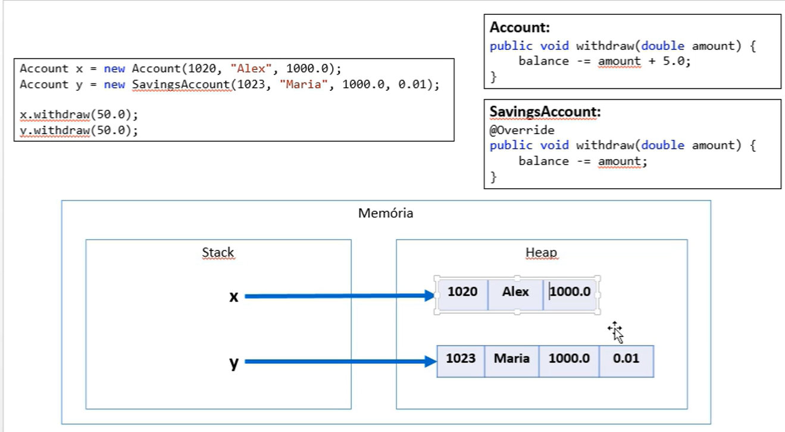
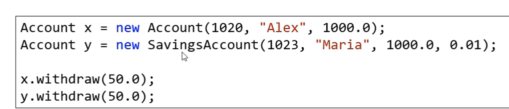

# Herança e Polimorfismo

## Herança
é um tipo de associação que permite que uma classe herde todos os dados e comportamentos de oura

Vantagens: reuso e Polimorfismo.
SINTAXE: classe A extend B

OBSERVAÇÕES:
-Herança é uma relação é-um
-Generalização/especialização ( no exemplo a classe Account é Generalização e a BusinessAccount é uma especialização)
-Superclasse(classe base) é Account/ subclasse(classe derivada) é a classe BusinessAccount.
-Herança e extenção( que pode acrescentar mais características)
- Herança é uma associação entre classe e não entre objetos

## upCasting e downCasting:

-upCasting:
Casting da subclasse para superclasse
Uso comum: polimorfismo

-downCasting:
Casting da supercalasse para a subclasse
    -palavra instaceof
Uso comum: métodos que recebem parâmetros genéricos (ex:Equals)

## Sobreposição ou sobrecarga:
é uma implementação de um método de uma superclasse na subclasse.

é fortemente recomendável usar a anotação @override em um método sobrescrito
    -facilita a leitura e compreensão do código.
    -Avisamos ao compilador;

## PALAVRA SUPER

É possivel chamar a implementação da superclasse usando a palavra super. 

Exemplo: suponha que, na classe BusinessAccount, a regra para saque seja realizar o saque 
normalmente da superclasse descontar mais 2.0;

@Override 
public void withdraw(double amount){
    super.withdraw(amount);
balance-=2.0;

## CLASSES E MÉTODOS FINAL

Palavra chave: final

Classe: evita que a classe seja herdada

    public final class SavigsAccount{

Exemplo- Classe final
    Suponha que você queira evitar qye sejam criadas subclasses de SavigsAccount
    
    public final class SavigsAccount{
        (...)

Método: evita que o método seja sobreposto.
    Suponha que você não queira que o método Withdraw de SavingsAccount seja sobreposto

@Override
public final void Withdraw(double amount){
    Balance -= amount;
}

PRA QUE QUÊ USAR?

SEGURANÇA: dependendo da regra de negócio, às vezes é desejável garantir 
que uma classe não seja herdada, ou que um método não seja sobreposto. 
    -Geralmente convém acrecentar final em métodos sobrepostos, pois sobreposição 
mútiplas podem ser uma porta de entrada para inconsistências.

PERFORMANCE:atributos de tipo de uma classe final são analisados de forma mais rápida em tempo de execução.
    -Exemplo clássico: String

## Pilares da OOP
-Encapsulamento;
-Herança e 
-Polimorfismo

### POLIMORFISMO 
Em programação Orientada a Objetos, Polimorfismo é um recurso que permite que váriáveis de um mesmo tipo mais 
genérico possam apontar para objetos de tipos específicos diferentes, tendo assim comportamentos diferentes conforme 
cada tipo específico.

### Importante entender: 
- A Associação do tipo específico com o tipo genérico é feita em tempo de execução(upcasting).
- O compilador não sabe para qual tipo específico a chamada do método Withdraw está sendo feita 
(ele só sabe que são duas variáveis tipo Account):

